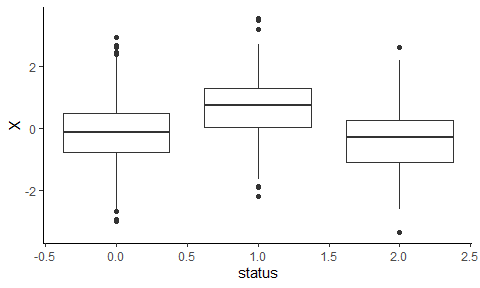
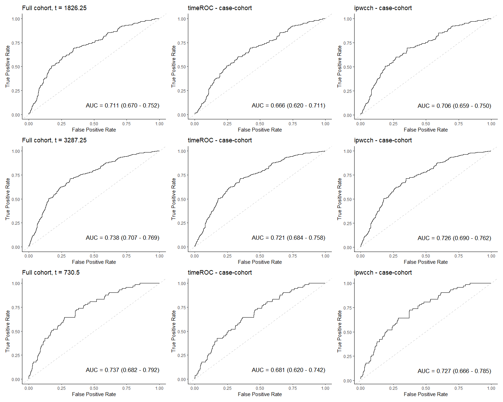
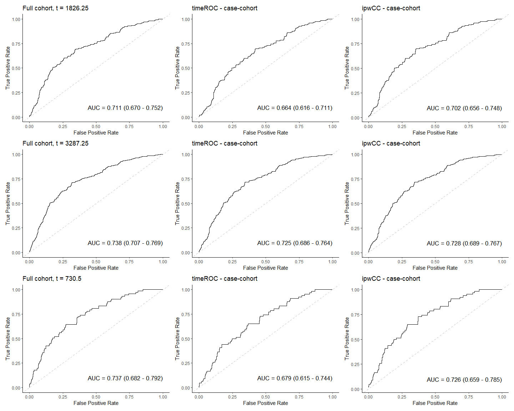
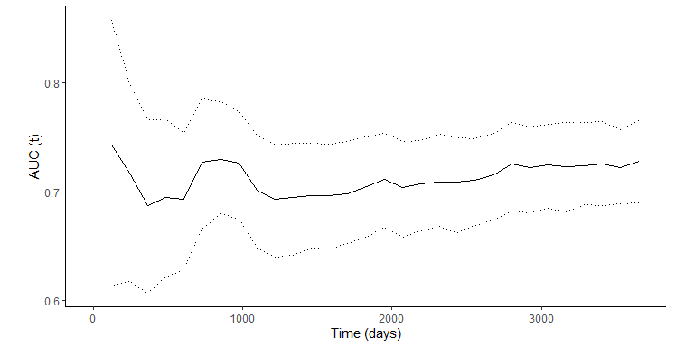
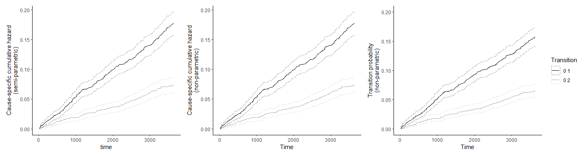
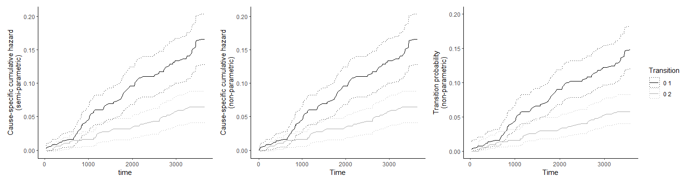
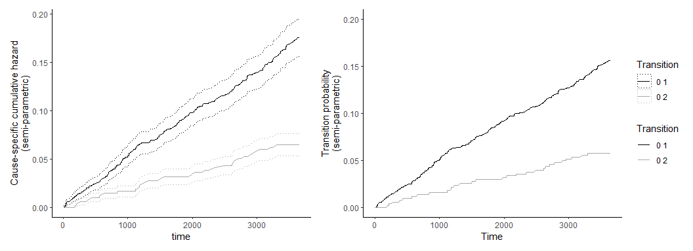
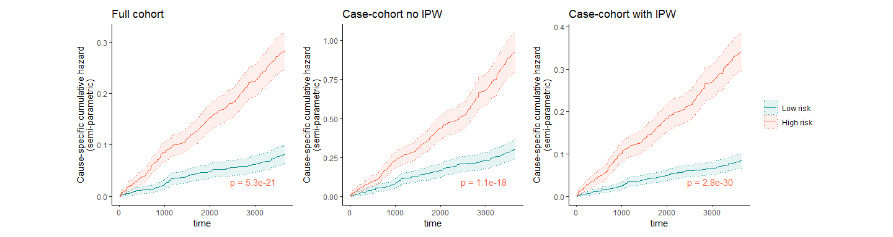

## Goal

Evaluate performance of `ipwCC` by comparing results from the full
cohort with those obtained for the case-cohort with/without inverse
probability of sample weights (IPW).

## Simulate full cohort with competing risk

``` r
set.seed(42)
n <- 2000 # Individuals in cohort
lambda1 <- 0.00004 # Baseline hazard for main disease
lambda2 <- 0.00002 # Baseline hazard for competing cause
meanX <- 0   # Mean of the continuous disease marker
sdX <- 1 # SD of continuous disease marker
censoring <- "administrative" # For informative censoring IPCW is needed, not implemented by ipwCC. timeROC would be suitable for full cohort.
Tmax <- 3652.5 # Maximum 10 years follow up
censor.rate <- NULL

cohort <- simFullCohort(
  n = n,
  lambda1 = lambda1,
  lambda2 = lambda2,
  meanX = meanX,
  sdX = sdX,
  censoring = censoring,
  Tmax = Tmax,
  censor.rate = censor.rate
)

sim_data <- cohort # Keep first data format for comparisons to other packages
```

``` r
head(sim_data)
```

    ##   id     time status          X
    ## 1  1 1894.600      1  1.3709584
    ## 2  2 1088.052      1 -0.5646982
    ## 3  3 3652.500      0  0.3631284
    ## 4  4 3652.500      0  0.6328626
    ## 5  5 1918.063      1  0.4042683
    ## 6  6 1199.221      2 -0.1061245

- Number of censored (0), main (1) and competing (2) causes:

<!-- -->

    ## 
    ##    0    1    2 
    ## 1556  314  130

- Event time summary:

<!-- -->

    ##     Min.  1st Qu.   Median     Mean  3rd Qu.     Max. 
    ##    7.717 3652.500 3652.500 3232.387 3652.500 3652.500

- Disease marker time-independent performance:

<!-- -->

## Sample case-cohort

``` r
# Case-cohort without missing data
set.seed(43)
N <- nrow(sim_data)
Nsub <- 500 # Size of subcohort
Psub <- Nsub/N # Sampling probability
random_sub <- sample(1:N, Nsub) # Randomly sample sub-cohort
ind_case <- which(sim_data$status == 1) # Locate all cases
cc_ind <- unique(c(random_sub, ind_case))
sampleInd <- rep(0, N)
sampleInd[cc_ind] <- 1

sim_data_cch <- sim_data
sim_data_cch$subcohort <- 0 # Indicator subcohort
sim_data_cch$subcohort[random_sub] <- 1 # Subcohort individuals randomly sampled (independent of status)
sim_data_cch <- sim_data_cch[sampleInd == 1, ] # Subset the final cch (subcohort + remaining cases)

cohort_cch <- cohort[sampleInd == 1, ] # Keep first data format for comparisons to other packages
```

- Number of censored (0), main (1) and competing (2) causes in the
  sampled case-cohort + non-subcohort cases:

``` r
table(sim_data_cch$status,sim_data_cch$subcohort)
```

    ##    
    ##       0   1
    ##   0   0 397
    ##   1 240  74
    ##   2   0  29

## Missing data - effective sample probabilities

- Simulate missing data by post-sample removal (e.g., biomarker analysis
  failed) <br>
- Effective sampling probability Psub\* = Psub x (1 - msub); with msub
  the proportion of missing samples from the subcohort and Psub the true
  sampling probability of the subcohort <br>

``` r
# Case-cohort with missing data
sim_data_cch_missing <- sim_data_cch

# Randomly assign missing biomarker values
set.seed(34)
ind_missing <- sample(1:nrow(sim_data_cch), 80)
sim_data_cch_missing$X[ind_missing] <- NA

# Calculate the effective sampling probability
n_missing_sub <- sum(sim_data_cch_missing$subcohort == 1 & is.na(sim_data_cch_missing$X))
n_sub <- sum(sim_data_cch_missing$subcohort == 1)
msub <- n_missing_sub/n_sub # Proportion of missing samples in subcohort
Psub_missing = Psub * (1-msub)
  
# Remove lines with missing values
sim_data_cch_missing <- sim_data_cch_missing[!is.na(sim_data_cch_missing$X), ] 

cohort_cch_missing <- sim_data_cch_missing # Set this format aside
```

## Inverse probability of sample weights

- Prentice approach <br>
- Review O’Brien: <doi:10.1097/EDE.0000000000001469>, weighting scheme
  for a simple design implemented <br>
- A small value is chosen to deal with changing weights of cases over
  time <br>
- Non-cases outside of the subcohort get a weight of zero <br>
- Cases outside of the subcohort enter shortly before incidence and get
  a weight of 1 <br>
- Non-cases in the subcohort get a weight of 1/sampling probability <br>
- Cases inside of the subcohort contribute as non-case shortly until
  incidence, and chance to weight 1 after incidence <br>

``` r
sim_data_cch <- assignWeightsCch(sim_data_cch, Psub = Psub, eps = 0.00005)
sim_data_cch_missing <- assignWeightsCch(sim_data_cch_missing, Psub = Psub_missing, eps = 0.00005)

head(sim_data_cch)
```

    ##    id      time status          X subcohort     entry      exit from to weight
    ## 1   1 1894.5997      1  1.3709584         1    0.0000 1894.5997    0  0      4
    ## 11  1 1894.5997      1  1.3709584         1 1894.5997 1894.5997    0  1      1
    ## 21  2 1088.0522      1 -0.5646982         0 1088.0521 1088.0522    0  1      1
    ## 52  5 1918.0628      1  0.4042683         0 1918.0628 1918.0628    0  1      1
    ## 71  7 3253.2972      1  1.5115220         0 3253.2971 3253.2972    0  1      1
    ## 92  9  282.4137      1  2.0184237         0  282.4137  282.4137    0  1      1

``` r
# Additional variables entry, exit, from, to are created to allow for dynamic modeling using left-truncation
# Create these also for the full sim_data set

sim_data$entry <- 0
sim_data$exit <- sim_data$time
sim_data$from <- 0
sim_data$to <- sim_data$status
sim_data$weight <- 1
```

## Time-dependent ROC analysis

### Overview existing packages

| Package                           | ipwCC | timeROC | survMarkerTwoPhase | pROC |
|:----------------------------------|:------|:--------|:-------------------|:-----|
| Time-dependent ROC                | V     | V       | V                  | X    |
| AUC with CI                       | V     | V       | V                  | V    |
| Competing risks (\*)              | V     | V       | X                  | X    |
| Case-cohort design (IPW)          | V     | X       | V                  | X    |
| Informative censoring (IPCW \*\*) | X     | V       | V                  | X    |

(\*) For now only implementing definition (ii) of a control in the case
of competing events (Zheng 2012: 10.1111/j.1541-0420.2011.01671.x) <br>
(i) Event-free at t: prediction among those alive and free of all events
at t <br> (ii) Not a case at t: include as control those who had
competing events <br>

The package timeROC includes an implementation for both definitions.
<br>

(\*\*) For IPCW, the full cohort information (time and status, not
biomarker) is needed.

### Benchmark

- Compare (true) AUC calculated for the full cohort (timeROC), with
  estimates for the case-cohort obtained with timeROC (IPWC weighting)
  and ipwCC (IPW weighting):

``` r
# Time points we like to get estimates for
t_eval1 <- 1826.25 # 5 years
t_eval2 <- 3287.25 # 9 years, timeROC does not work for Tmax
t_eval3 <- 730.5 # 2 years

# Example code for first time point

# First, we calculate the true ROCs and AUCs from the full cohort at a given time using timeROC:
test <- timeROC(T = cohort$time,
                delta = cohort$status,
                marker = cohort$X,
                other_markers = NULL,
                cause = 1, # Main disease
                weighting = "marginal", # ~ Kaplan Meier estimator for non-informative sensoring
                times = c(0, t_eval1),
                ROC = TRUE,
                iid = TRUE)
result.ci <- confint(object = test, level = 0.95, n.sim = 1000) %>% as.data.frame() 
p1 <- plot_timeROC(test, result.ci, definition = 2, time_index = 2) # Definition 2 for dealing with competing events, competing events are treated as controls
p1 <- p1 + ggtitle(paste0("Full cohort, t = ",t_eval1))

# Estimates for the case-cohort using timeROC, with IPCW for censoring implemented: 
test <- timeROC(T = cohort_cch$time,
                delta = cohort_cch$status,
                marker = cohort_cch$X,
                other_markers = NULL,
                cause = 1, # Main disease
                weighting = "marginal", # ~ Kaplan Meier estimator for non-informative sensoring
                times = c(0, t_eval1),
                ROC = TRUE,
                iid = TRUE)
result.ci <- confint(object = test, level = 0.95, n.sim = 1000) %>% as.data.frame() 
p2 <- plot_timeROC(test, result.ci, definition = 2, time_index = 2)
p2 <- p2 + ggtitle("timeROC - case-cohort")

# Estimates for the case-cohort using ipwCC, with IPC for sampling implemented: 
marker = "X" # Biomarker predictive of disease
event_code = 1 # Main disease

test <- weightedRoc(sim_data_cch, t_eval = t_eval1, marker = marker, event_code = event_code)
test_auc <- aucWithCI(sim_data_cch, t_eval = t_eval1, marker = marker, event_code = event_code, n_boot = 1000, seed = 42)
p3 <- plot_ROC(test, test_auc)
p3 <- p3 + ggtitle("ipwCC - case-cohort")
```

<!-- -->

- Compare (true) AUC calculated for the full cohort (timeROC), with
  estimates for the case-cohort obtained with timeROC (IPWC weighting)
  and ipwCC (IPW weighting) in the dataset with samples removed post
  case-cohort sampling. The ipwCC method should correctly account for
  this when sampling probabilities are replaced with effective sampling
  probabilities:

``` r
# Time points we like to get estimates for
t_eval1 <- 1826.25 # 5 years
t_eval2 <- 3287.25 # 9 years, timeROC does not work for Tmax
t_eval3 <- 730.5 # 2 years

# Example code for first time point

# First, we calculate the true ROCs and AUCs from the full cohort at a given time using timeROC:
test <- timeROC(T = cohort$time,
                delta = cohort$status,
                marker = cohort$X,
                other_markers = NULL,
                cause = 1, # Main disease
                weighting = "marginal", # ~ Kaplan Meier estimator for non-informative sensoring
                times = c(0, t_eval1),
                ROC = TRUE,
                iid = TRUE)
result.ci <- confint(object = test, level = 0.95, n.sim = 1000) %>% as.data.frame() 
p1 <- plot_timeROC(test, result.ci, definition = 2, time_index = 2) # Definition 2 for dealing with competing events, competing events are treated as controls
p1 <- p1 + ggtitle(paste0("Full cohort, t = ",t_eval1))

# Estimates for the case-cohort using timeROC, with IPCW for censoring implemented: 
test <- timeROC(T = cohort_cch_missing$time,
                delta = cohort_cch_missing$status,
                marker = cohort_cch_missing$X,
                other_markers = NULL,
                cause = 1, # Main disease
                weighting = "marginal", # ~ Kaplan Meier estimator for non-informative sensoring
                times = c(0, t_eval1),
                ROC = TRUE,
                iid = TRUE)
result.ci <- confint(object = test, level = 0.95, n.sim = 1000) %>% as.data.frame() 
p2 <- plot_timeROC(test, result.ci, definition = 2, time_index = 2)
p2 <- p2 + ggtitle("timeROC - case-cohort")

# Estimates for the case-cohort using ipwCC, with IPC for sampling implemented: 
marker = "X" # Biomarker predictive of disease
event_code = 1 # Main disease

test <- weightedRoc(sim_data_cch_missing, t_eval = t_eval1, marker = marker, event_code = event_code)
test_auc <- aucWithCI(sim_data_cch_missing, t_eval = t_eval1, marker = marker, event_code = event_code, n_boot = 1000, seed = 42)
p3 <- plot_ROC(test, test_auc)
p3 <- p3 + ggtitle("ipwCC - case-cohort")
```

<!-- -->

- ipwCC also has a built-in function to compute AUC with CI over time:

``` r
times <- seq(0,max(sim_data_cch$time), by = 365.25/3) # per 4 months
auc_t <- aucOverTime(sim_data_cch, times = times, marker = marker, event_code = event_code, n_boot = 1000, seed = 42)

ggplot(data=auc_t, aes(x=t_eval,y=AUC))+
    geom_line()  +
    geom_line(size=0.7) +
    geom_ribbon(aes(ymin=CI_lower,ymax=CI_upper),
                fill = NA, color = "black", linetype = "dotted") +
    xlab('Time (days)') +
    ylab('AUC (t)') +
    theme_classic() +
    theme(legend.title = element_blank(),
          aspect.ratio=0.5)
```

<!-- -->

Though it is not the case in the simulated data here, if a sharp drop in
the AUC occurs with wider CIs nearing max time, it is worthwile to check
whether this might be due to variations in censoring times as follows:

``` r
min(sim_data_cch$exit[which(sim_data_cch$status == 0)])
```

    ## [1] 3652.5

``` r
max(sim_data_cch$exit[which(sim_data_cch$status == 0)])
```

    ## [1] 3652.5

If there is a small difference in the min and max for the censored
individuals you should consider applying a buffer when evaluating ROC at
times near tmax, so that censored individuals with times slightly
shorter than tmax are still considered at risk:

``` r
# Example applying buffer of 10 days for times near tmax:
test <- weightedRoc(sim_data_cch, t_eval = t_eval3, marker = marker, event_code = event_code, eps = 10)
test_auc <- aucWithCI(sim_data_cch, t_eval = t_eval3, marker = marker, event_code = event_code, eps = 10, n_boot = 1000, seed = 42)
auc_t <- aucOverTime(sim_data_cch, times = times, marker = marker, event_code = event_code, eps = 10, n_boot = 1000, seed = 42)
```

## Absolute risk assessment

- Estimate the probability that an individual will experience the event
  of interest by time t <br>

### Overview existing methods

- Cause-specific hazards estimated using the Cox model (semi-parametric)
  or the Nelson-Aalen estimator (non-parametric) <br>
- Cumulative incidence functions accounting for competing risks
  (transition probabilities estimated via the Aalen-Johansen estimator),
  either directly (non-parametric) or derived from Cox models
  (semi-parametric) <br>
- Below is a demonstration of how to analyze a full cohort, the
  subcohort of the case-cohort or the full case-cohort using existing
  packages. <br>
- ipwCC only has helper functions for displaying analysis results. <br>

### Example analyses

- Full cohort: <br>

``` r
# Semi-parametric approach (relies on Cox and proportional hazard assumptions)
# # Fit Cox models for event 1 and 2
cox_e1 <- survfit(coxph(Surv(entry, exit, to == 1) ~ 1, robust = TRUE, id = id, sim_data)) # no weights
cox_e2 <- survfit(coxph(Surv(entry, exit, to == 2) ~ 1, robust = TRUE, id = id, sim_data)) # no weights

p1 <- plot_AbsRiskCox2Events(cox_e1,cox_e2)

# Parametric estimates
# Define a transition matrix (here 0 -> 1 or 0 -> 2) to compute the Nelson-Aalen estimator of the cumulative transition hazards in a multi-state model with mvna {mvna}.
# Estimate the hazard function for both events non-parametrically (no assumption about the distribution of failure times) using bshazard {bshazard}. 
# Lastly the empirical transition matrix (Aalen-Johansen estimator) of the transition probability matrix of the multi-state model is computed using the etm {etm} function.
# Modified from: https://pmc.ncbi.nlm.nih.gov/articles/PMC9482967/#s0003
# Example code: https://www.dovepress.com/article/supplementary_file/357494/357494.pdf
# Further reading "Competing risks and multistate models with R" by Beyersmann et al

# Define a transition matrix 
traCRetm <- matrix(FALSE, 3, 3)
traCRetm[1,2] <- TRUE
traCRetm[1,3] <- TRUE

# Define transition names
traCR <- matrix(NA, 3, 3)
traCR[1,2] <- 1
traCR[1,3] <- 2

# Arrange input data for mvna()
# One row per transition, entry/exit time enables to account for left-trunction
dat <- sim_data %>% 
  dplyr::select(id,from,to,entry,exit) %>%
  dplyr::mutate(to = case_when(
    to == 0 ~ "cens", TRUE ~ as.character(to)
  ))

# Calculate the cause-specific cumulative hazards for each possible transition (Nelson-Aalen estimator).
cumHaz.my.data <- mvna::mvna(dat, c("0","1","2"), traCRetm, "cens")

p2 <- plot_AbsRiskNA2Events(cumHaz.my.data)

# # Estimate the hazard functions for both events
# bs2 <- bshazard::bshazard(survival::Surv(entry, exit, to == 2) ~ 1, data = dat)
# bs1 <- bshazard::bshazard(survival::Surv(entry, exit, to == 1) ~ 1, data = dat)

# Aalen-Johansen estimator (empirical transition matrix) of the transition probability matrix of the multistate model
# Considers competing risks
transprob <- etm::etmCIF(Surv(entry, exit, to != "cens") ~ 1, dat, etype = to, failcode = 1)

p3 <- plot_AbsRiskNpaj2Events(transprob)
p3 <- p3 + ylim(0,0.2)

p1 + p2 + p3 + plot_layout(guides = "collect")
```

<!-- -->

- Case-cohort, only subcohort (no information on competing events
  outside of the subcohort), so no weighting needed: <br>

``` r
subcohort_ids <- sim_data_cch %>% dplyr::filter(subcohort == 1) %>% pull(id) %>% unique()

sim_data_cch_subcohort <- sim_data %>% 
  dplyr::filter(id %in% subcohort_ids)  # Only members subcohort

# Semi-parametric approach (relies on Cox and proportional hazard assumptions)
# # Fit Cox models for event 1 and 2
cox_e1 <- survfit(coxph(Surv(entry, exit, to == 1) ~ 1, robust = TRUE, id = id, sim_data_cch_subcohort)) # no weights
cox_e2 <- survfit(coxph(Surv(entry, exit, to == 2) ~ 1, robust = TRUE, id = id, sim_data_cch_subcohort)) # no weights

p1 <- plot_AbsRiskCox2Events(cox_e1,cox_e2)

# Parametric estimates

# Define a transition matrix 
traCRetm <- matrix(FALSE, 3, 3)
traCRetm[1,2] <- TRUE
traCRetm[1,3] <- TRUE

# Define transition names
traCR <- matrix(NA, 3, 3)
traCR[1,2] <- 1
traCR[1,3] <- 2

# Arrange input data for mvna()
# One row per transition, entry/exit time enables to account for left-trunction
dat <- sim_data_cch_subcohort %>% 
  dplyr::select(id,from,to,entry,exit) %>%
  dplyr::mutate(to = case_when(
    to == 0 ~ "cens", TRUE ~ as.character(to)
  ))

# Calculate the cause-specific cumulative hazards for each possible transition (Nelson-Aalen estimator).
cumHaz.my.data <- mvna::mvna(dat, c("0","1","2"), traCRetm, "cens")

p2 <- plot_AbsRiskNA2Events(cumHaz.my.data)

# # Estimate the hazard functions for both events
# bs2 <- bshazard::bshazard(survival::Surv(entry, exit, to == 2) ~ 1, data = dat)
# bs1 <- bshazard::bshazard(survival::Surv(entry, exit, to == 1) ~ 1, data = dat)

# Aalen-Johansen estimator (empirical transition matrix) of the transition probability matrix of the multistate model
# Considers competing risks
transprob <- etm::etmCIF(Surv(entry, exit, to != "cens") ~ 1, dat, etype = to, failcode = 1)

p3 <- plot_AbsRiskNpaj2Events(transprob)
p3 <- p3 + ylim(0,0.2)

p1 + p2 + p3 + plot_layout(guides = "collect")
```

<!-- -->

- Case-cohort with weighting, but using for competing events only the
  subcohort. Only semi-parametric approaches are available: <br>

``` r
sim_data_cch1 <- sim_data_cch 
sim_data_cch2 <- sim_data_cch1 %>% dplyr::filter(subcohort == 1) # Keep only subcohort for competing event
  
# Semi-parametric approach (relies on Cox and proportional hazard assumptions)
# Fit Cox models for event 1 and 2
cox_e1 <- survfit(coxph(Surv(entry, exit, to == 1) ~ 1, robust = TRUE, id = id, data = sim_data_cch1, weights = weight))
cox_e2 <- survfit(coxph(Surv(entry, exit, to == 2) ~ 1, robust = TRUE, id = id, data = sim_data_cch2, weights = weight))

p1 <- plot_AbsRiskCox2Events(cox_e1,cox_e2)

# Semi-parametric approach transition probability to allow for weighting
cox_e1 <- coxph(Surv(entry, exit, to == 1) ~ 1, robust = TRUE, id = id, data = sim_data_cch1, weights = weight) 
cox_e2 <- coxph(Surv(entry, exit, to == 2) ~ 1, robust = TRUE, id = id, data = sim_data_cch2, weights = weight) 

# Estimate the hazard functions for both events
bs1 <- basehaz(cox_e1, centered = FALSE)
bs2 <- basehaz(cox_e2, centered = FALSE)

# Transition names
traCR <- matrix(NA, 3, 3)
traCR[1,2] <- 1
traCR[1,3] <- 2

# Prepare msfit object
times <- bs1$time
FinalTime <- c(times, times)
colTrans <- c(rep(1, length(times)), rep(2, length(times)))
haz1 <- mixin12(bs1, times)
haz2 <- mixin12(bs2, times)
hazard <- rbind(haz1, haz2)
hazard <- data.frame(time = FinalTime,
Haz = hazard$hazard,
trans = colTrans)
resw <- list(Haz = hazard, trans = traCR)
class(resw) <- "msfit"

# Transition probabilities
TransProb.cc.w <- mstate::probtrans(resw, predt = 0, variance = F)

p2 <- plot_AbsRiskSpaj2Events(TransProb.cc.w)
p2 <- p2 + ylim(0,0.2)

p1 + p2 + plot_layout(guides = "collect")
```

<!-- -->

## Relative risk assessment

- Estimate the probability that an individual will experience the event
  of interest by time t <br>

### Overview existing methods

- Cause-specific hazard ratios estimated using the Cox proportional
  hazards model (semi-parametric), stratified or smoothed Nelson-Aalen
  estimators or kernel-based methods (non-parametric) <br>
- Subdistribution hazard ratios for competing risks estimated using the
  Fine-Gray model (semi-parametric) or group-specific cumulative
  incidence functions (non-parametric) <br>
- Below we will test the effect of IPW for case-cohort analysis for
  semi-parametric cause-specific hazard ratio’s <br>
- ipwCC only has helper functions for displaying analysis results. <br>

### Benchmark

``` r
# First, we calculate the hazard ratio's for the full cohort:

# Define risk groups
cutoff <- median(cohort$X)
cohort <- cohort %>%
  dplyr::mutate(strat = factor(ifelse(X < cutoff, "Low risk", "High risk"),
                        levels = c("Low risk", "High risk"))) 

# Fit the Cox Proportional Hazards model for main cause and calculate p-value
fit <- survfit(Surv(time, status == 1) ~ strat, data = cohort)
fitcox <- coxph(Surv(time, status == 1) ~ strat, data = cohort) # Note that survdiff does not support left truncation
fit$pvalue <- summary(fitcox)$coefficients[, "Pr(>|z|)"]

# Check if any covariates violate PH assumption (Schoenfeld test)
zph_pvals <- cox.zph(fitcox)$table[, "p"]
if (any(zph_pvals < 0.05)) {
  cat("Warning: proportional hazards assumption is violated\n")
}

p1 <- plot_RelRiskCox(cohort,fit,c("darkcyan","tomato"))
p1 <- p1 + ggtitle("Full cohort")

# Case-cohort, no IPW:

# Define risk groups
cutoff <- median(cohort_cch$X)
cohort_cch <- cohort_cch %>%
  dplyr::mutate(strat = factor(ifelse(X < cutoff, "Low risk", "High risk"),
                        levels = c("Low risk", "High risk"))) 

# Fit the Cox Proportional Hazards model for main cause (for competing event should use subcohort only)
fit <- survfit(Surv(time, status == 1) ~ strat, data = cohort_cch)
fitcox <- coxph(Surv(time, status == 1) ~ strat, data = cohort_cch)
fit$pvalue <- summary(fitcox)$coefficients[, "Pr(>|z|)"]

# Check if any covariates violate PH assumption (Schoenfeld test)
zph_pvals <- cox.zph(fitcox)$table[, "p"]
if (any(zph_pvals < 0.05)) {
  cat("Warning: proportional hazards assumption is violated\n")
}

p2 <- plot_RelRiskCox(cohort_cch,fit,c("darkcyan","tomato"))
p2 <- p2 + ggtitle("Case-cohort no IPW")

# Case-cohort, with IPW:
# Define risk groups
cutoff <- median(sim_data_cch$X)
sim_data_cch <- sim_data_cch %>%
  dplyr::mutate(strat = factor(ifelse(X < cutoff, "Low risk", "High risk"),
                        levels = c("Low risk", "High risk"))) 

# Fit the Cox Proportional Hazards model for main cause (for competing event should use subcohort only)
fit <- survfit(Surv(entry, exit, to == 1) ~ strat, data = sim_data_cch, weights = weight)
fitcox <- coxph(Surv(entry, exit, to == 1) ~ strat, data = sim_data_cch, weights = weight) # Note that survdiff does not support left truncation
fit$pvalue <- summary(fitcox)$coefficients[, "Pr(>|z|)"]

# Check if any covariates violate PH assumption (Schoenfeld test)
zph_pvals <- cox.zph(fitcox)$table[, "p"]
if (any(zph_pvals < 0.05)) {
  cat("Warning: proportional hazards assumption is violated\n")
}

p3 <- plot_RelRiskCox(sim_data_cch,fit,c("darkcyan","tomato"))
p3 <- p3 + ggtitle("Case-cohort with IPW")

p1 + p2 + p3 + plot_layout(guides = "collect")
```

<!-- -->
